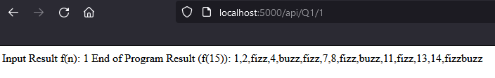
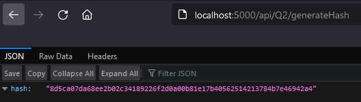
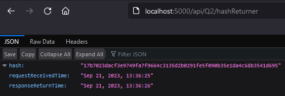
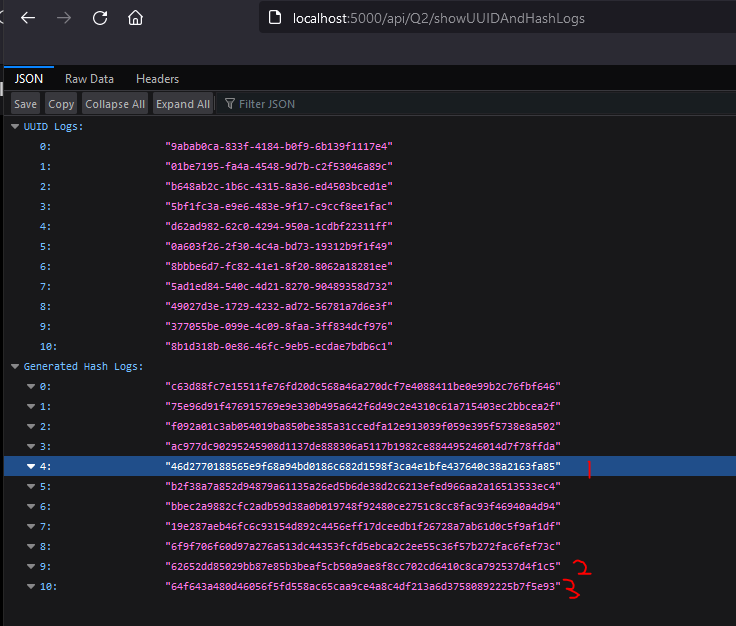
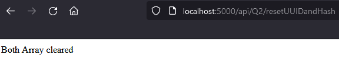
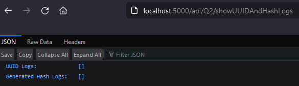
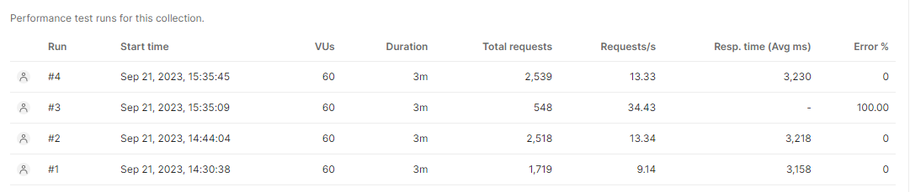
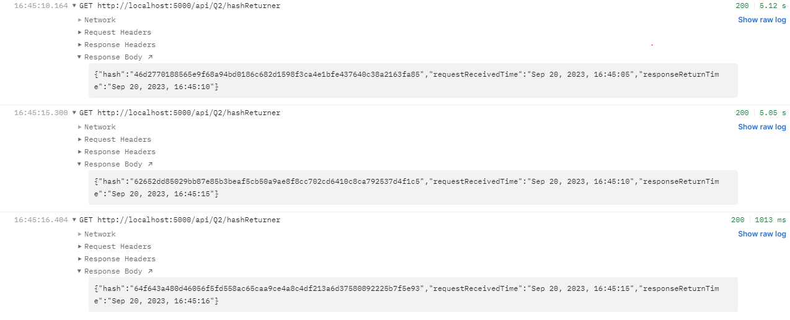

# Auronex Endpoints

- Default port is currently on **5000** or if there is a value set for **PORT** in the .env file.
- It will also contain all the endpoints with description and an image example.
- A small load test for **Question 2 Endpoint 2** where it returns a **hash number** only when **its last character is a number and a odd number**.
- Data will only exist during its runtime.

## Question 1 Endpoints

### API Endpoint of **GET** with path of **/api/Q1/:n** (fizzbuzz counter printer)

- Loops n times and replace numbers that is divisible by 3 to "fizz", by 5 to "buzz" and by both 3 and 5 to "fizzbuzz", where n is a number that is > 0.
- It will return a String with the F(n) and F(15) result.

## Question 2 Endpoints

### API Endpoint of **GET** with path of **/api/Q2/generateHash** (unique hash generator)

- Generates a hash of SHA-256 from a Unique String value generated by uuid library that only returns after 1 second.
- It will return a JSON with {"hash": (value)}.

### API Endpoint of **GET** with path of **/api/Q2/hashReturner** (unique hash generator)

- Returns a Response once it gets a **last index odd number Hash** from Q2 Endpoint 1.
- It will return a JSON with {"hash": (value),"requestReceivedTime":(value),"responseReturnTime":(value)}.

### Misc API Endpoint of **GET** with path of **/api/Q2/showUUIDAndHashLogs** (unique hash generator)

- Shows all UUID and Hash that has been created and stored unless resetted or restarted.
- It will return a JSON with {"UUID Logs": ([UUIDValue]),"Generated Hash logs": ([HashValue])}.

### Misc API Endpoint of **GET** with path of **/api/Q2/resetUUIDandHash** (unique hash generator)

- Clears both UUID and Hash Array to empty array.
- It will return a String with "Both Array cleared".

**Before**

**After**

## Load Test for Question 2 Endpoint of **/api/Q2/hashReturner**

- All test are done in 3 mins duration.
- Test #1 is a ramp up of user to a max of 60 user until the 2 minute point and then a 1 minute constant 60 user.
- Test #2 is a constant 60 user for 3 minutes.
- Test #4 is also a constant 60 user for 3 minutes.

## Test to show Question 2 Endpoint of **/api/Q2/hashReturner**

- Done using Postman Runner for Functional Test with 3 interations with 1 ms delay.
- Small load test to show as example below.
- From the Debug log, 3 odd number ended Hash were found and marked with number and it will correspond to the results seen in the Run Image.

**Run**

**Debug Log**

